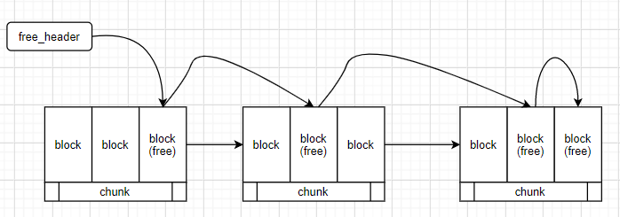

# 内存池与分配器

## 基本信息

| 姓名     | 徐震                                                       | 宗威旭                                                     |
| -------- | ---------------------------------------------------------- | ---------------------------------------------------------- |
| 学号     | 3180105504                                                 | 318010xxxx                                                 |
| 年级     | 2018级                                                     | 2018级                                                     |
| 专业     | 计算机科学与技术                                           | 计算机科学与技术                                           |
| 电话     | 18888916826                                                | 1888891xxxx                                                |
| 邮箱     | [3180105504@zju.edu.cn](mailto:3180105504@zju.edu.cn)      | [318010xxxx@zju.edu.cn](mailto:318010xxxx@zju.edu.cn)      |
| GitHub   | [dendenxu](https://github.com/dendenxu)                    | github.com/xxx                                             |
| 作业仓库 | [AllocatorPool](https://github.com/dendenxu/AllocatorPool) | [AllocatorPool](https://github.com/dendenxu/AllocatorPool) |
| 指导教师 | 许威威                                                     | 许威威                                                     |
| 分工情况 | 内存资源管理（`Memory Resource`）                          | 内存管理接口（`Allocator`）                                |

## 实验环境

| 机器环境 | Dell Inspiron 7590                         |
| -------- | ------------------------------------------ |
| CPU      | 2.6 GHz 6-Core/12-Logic Intel Core i7-9750 |
| Memory   | 16 GB 2666 MHz DDR4                        |
| Disk     | 500 GB Solid State PCI-Express Drive, NVMe |

# `Memory Resource`：内存资源管理

## `Monotonic Memory`：堆栈式内存资源

### 概要

我们通过最简单的方式实现了一种基于`index`的堆栈式内存资源。

初始化时，这种资源会将其`index`设置为零，并通过初始化参数确定其总体内存资源的大小。这种内存资源保有一个指向大型内存资源的指针，并通过开放接口来让外界获得其中的内存地址。在对内存进行最大程度利用的同时保持极高的性能。

### 具体实现

我们会在类内保有一个指向大型内存块的资源。并保有一个记录当前已经被分配内存的`index`。在分配内存时调整这一`index`，使其匹配当前分配出去的内存大小。当调用`free`接口进行内存释放时，我们会判断给出的指针与调整`index`之前的指针是否匹配。

我们提供了以下接口：

```c++
MonoMemory(const std::size_t size);
MonoMemory(const std::size_t size, std::byte *pointer);
std::size_t free_count();
std::size_t size();
std::size_t capacity();
bool empty();
bool full();
bool has_upper();
void *get(std::size_t size);
void free(void *pblock, std::size_t size);
void free(std::size_t size);
```

- 其中最核心的接口是`get`与`free`

    1. `get`可以为上层资源提供参数中说明数量的内存，若无法正常分配则会返回`nullptr`。
    2. `free`函数会收回一定数量的内存，其中第一个参数的内存地址在具体实现时可有可无，但可以用于判断用户是否在正确的地方释放了正确的内存，方便调试与检测内存泄漏。

- 在初始化`MonoMemory`时，我们提供了两个初始化版本。

    1. 只确定内存资源大小的初始化：`ByteMemory(const std::size_t size);`会调用系统的`new`和`free`来获得`size` 所需大小的内存资源，对应的，在本`MonoMemory`被释放时，他会调用相应位置的`delete`操作符以清除对应位置的内存。
    2. 确定内存资源大小与初始指针的初始化：`MonoMemory(const std::size_t size, std::byte *pointer);`不会调用系统的相应内存分配操作，而是直接使用已经给出的内存资源。用户必须保证这一资源至少与参数`size`中所示的一样大，否则程序的行为将是未定义的。

- 我们还提供了一些管理用接口

    1. `std::size_t free_count();`返回当前该资源可用内存大小。
    2. `std::size_t size();`返回当前资源已用内存大小。
    3. `std::size_t capacity();`返回当前资源最多的可用内存大小。
    4. `bool empty();`用以判断当前资源是否为空资源（没有内存被分配到上层）。
    5. `bool full();`用以判断当前资源是否已分配完（没有可用资源供继续分配）。

具体实现：

接口

```c++
/** Pool Memory Resource Declaration */
// ! This class can only be used when sizeof(void *) <= sizeof(T)
// actually it's not even recommended to use memory pool if your block size is quite small, the pointers would take more space than the actual blocks!
// one possible usage for the allocator is that upon encountering a small sized block allocation request, it calls this pool memory resource to construct larger space, and savor the large block by itself
class PoolMemory
{
   public:
    PoolMemory(const std::size_t block_sz_bytes, const std::size_t num_blocks);
    PoolMemory(const std::size_t block_sz_bytes, const std::size_t num_blocks, std::byte *pmemory);

    PoolMemory(const PoolMemory &alloc) = delete;           // delete copy constructor
    PoolMemory &operator=(const PoolMemory &rhs) = delete;  // delete copy-assignment operator
    PoolMemory(PoolMemory &&alloc) = delete;                // delete move constructor
    PoolMemory &operator=(PoolMemory &&rhs) = delete;       // delete move-assignment operator

    ~PoolMemory();

    std::size_t block_size() { return m_block_sz_bytes; }                  // return block size in byte
    std::size_t pool_size() { return m_pool_sz_bytes; }                    // return memory pool size in byte
    std::size_t free_count() { return m_free_num_blocks; }                 // return number of free blocks inside the memory pool
    std::size_t size() { return m_total_num_blocks - m_free_num_blocks; }  // return the number of used space in the memory pool
    std::size_t capacity() { return m_total_num_blocks; }                  // return total number of blocks that this pool can hold
    bool empty() { return m_free_num_blocks == m_total_num_blocks; }       // return whether the memory pool is empty
    bool full() { return m_free_num_blocks == 0; }                         // return whether the memory pool is full
    bool has_upper() { return ~m_is_manual; }                              // return whether m_pmemory's raw mem comes from an upper stream

    // return a nullptr if the memory pool is already full
    // else this returns a pointer to an block whose size(still raw memory) is m_block_sz_bytes
    void *get(std::size_t size);
    void *get();

    // make sure the pblock is one of the pointers that you get from this memory pool
    void free(void *pblock, std::size_t size);
    void free(void *pblock);

   private:
    void init_memory();  // this function will fill the memory with pointers to the next trunk for initialization

    /** Current size of a memory pool variable should be 48 bytes
     *  considering 8 byte for one pointer and size_t on my machine
     */
    std::byte *m_pmemory;            // pointer to the first address of the pool, used to relase all the memory
    void **m_phead;                  // pointer to pointer, used to point to the head of the free list
    std::size_t m_pool_sz_bytes;     //the size in bytes of the pool
    std::size_t m_block_sz_bytes;    // size in bytes of each block
    std::size_t m_free_num_blocks;   // number of blocks
    std::size_t m_total_num_blocks;  // total number of blocks
    bool m_is_manual;                // whether the m_pmemory is manually allocated by us
};

/** Monotonic Memory Resource Declaration */
class MonoMemory
{
   public:
    MonoMemory(const std::size_t size);
    MonoMemory(const std::size_t size, std::byte *pointer);

    MonoMemory(const MonoMemory &alloc) = delete;           // delete copy constructor
    MonoMemory &operator=(const MonoMemory &rhs) = delete;  // delete copy-assignment operator
    MonoMemory(MonoMemory &&alloc) = delete;                // delete move constructor
    MonoMemory &operator=(MonoMemory &&rhs) = delete;       // delete move-assignment operator

    ~MonoMemory();

    std::size_t free_count() { return m_total_size - m_index; }  // return number of free blocks inside the byte chunk
    std::size_t size() { return m_index; }                       // return the number of used space in the byte chunk
    std::size_t capacity() { return m_total_size; }              // return total number of blocks that this pool can hold
    bool empty() { return m_index == 0; }                        // return whether the byte chunk is empty
    bool full() { return m_index == m_total_size; }              // return whether the byte chunk is full
    bool has_upper() { return ~m_is_manual; }                    // return whether m_pmemory's raw mem comes from an upper stream

    // return a nullptr if the byte chunk is already full
    // else this returns a pointer to an block whose size(still raw memory) is m_block_sz_bytes
    void *get(std::size_t size);

    // make sure the pblock is one of the pointers that you get from this byte chunk
    void free(void *pblock, std::size_t size);
    void free(std::size_t size);

   private:
    std::byte *m_pmemory;      // pointer to the byte array
    std::size_t m_index;       // current index of the byte array
    std::size_t m_total_size;  // total number of blocks
    bool m_is_manual;          // whether the m_pmemory is manually allocated by us
};
```

实现

```c++
/** Pool Memory Resource Implementation */
PoolMemory::PoolMemory(const std::size_t block_sz_bytes, const std::size_t num_blocks)
    : m_pool_sz_bytes(num_blocks * block_sz_bytes),
      m_block_sz_bytes(block_sz_bytes),
      m_free_num_blocks(num_blocks),
      m_total_num_blocks(num_blocks),
      m_is_manual(true)
{
    m_pmemory = new std::byte[m_pool_sz_bytes];  // using byte as memory pool base type
    init_memory();
}

PoolMemory::PoolMemory(const std::size_t block_sz_bytes, const std::size_t num_blocks, std::byte *pmemory)
    : m_pool_sz_bytes(num_blocks * block_sz_bytes),
      m_block_sz_bytes(block_sz_bytes),
      m_free_num_blocks(num_blocks),
      m_total_num_blocks(num_blocks),
      m_is_manual(false),
      m_pmemory(pmemory)  // this memory may have come from a different memory resource
{
    init_memory();
}
PoolMemory::~PoolMemory()
{
    if (m_is_manual) {
        delete[] m_pmemory;
    }
}  // delete the pre-allocated memory pool chunk

void PoolMemory::init_memory()
{
    /** We would want the size of the of the block to be bigger than a pointer */
    assert(sizeof(void *) <= m_block_sz_bytes);
    m_phead = reinterpret_cast<void **>(m_pmemory);  // treat list pointer as a pointer to pointer

    /** 
     * We're using uintptr_t to perform arithmetic operations with confidence
     * We're not using void * since, well, it's forbidden to perform arithmetic operations on a void *
     */
    std::uintptr_t start_addr = reinterpret_cast<std::uintptr_t>(m_pmemory);  // where the whole chunk memory begins
    std::uintptr_t end_addr = start_addr + m_pool_sz_bytes;                   // where the chunk memory ends

    /** We use the same space as the actual block to be stored here to store the free list pointers */
    // construct the linked list from raw memory
    for (auto i = 0; i < m_total_num_blocks; i++) {
        std::uintptr_t curr_addr = start_addr + i * m_block_sz_bytes;  // current block's address
        std::uintptr_t next_addr = curr_addr + m_block_sz_bytes;       // next block's address
        void **curr_mem = reinterpret_cast<void **>(curr_addr);        // a pointer, same value as curr_addr to support modification
        if (next_addr >= end_addr) {
            *curr_mem = nullptr;
        } else {
            *curr_mem = reinterpret_cast<void *>(next_addr);
        }
    }
}

/** Just a thin wrapper */
void *PoolMemory::get(std::size_t size)
{
    assert(size == m_block_sz_bytes);
    return get();
}

void *PoolMemory::get()
{
    // if (m_pmemory == nullptr) {  // This should not happen
    //     std::cerr << "ERROR " << __FUNCTION__ << ": No memory was allocated to this pool" << std::endl;
    //     return nullptr;
    // }

    if (m_phead != nullptr) {
        m_free_num_blocks--;  // decrement the number of free blocks

        void *pblock = static_cast<void *>(m_phead);  // get current free list value
        m_phead = static_cast<void **>(*m_phead);     // update free list head

        return pblock;
    } else {  // out of memory blocks (for an block with size m_block_sz_bytes)
        std::cerr << "ERROR " << __FUNCTION__ << ": out of memory blocks" << std::endl;
        throw std::bad_alloc();
        // return nullptr;  // if you get a nullptr from a memory pool, it's time to allocate a new one
    }
}

/** Just a thin wrapper */
void PoolMemory::free(void *pblock, std::size_t size)
{
    assert(size == m_block_sz_bytes);
    free(pblock);
}

void PoolMemory::free(void *pblock)
{
    if (pblock == nullptr) {
        // do nothing if we're freeing a nullptr
        // although this situation is declared undefined in C++ Standard
        return;
    }

    // if (m_pmemory == nullptr) {  // this should not happen
    //     std::cerr << "ERROR " << __FUNCTION__ << ": No memory was allocated to this pool" << std::endl;
    //     return;
    // }

    m_free_num_blocks++;  // increment the number of blocks

    if (m_phead == nullptr) {  // the free list is full (we can also check this by validating size)
        m_phead = static_cast<void **>(pblock);
        *m_phead = nullptr;
    } else {
        void *ppreturned_block = static_cast<void *>(m_phead);  // temporaryly store the current head as nex block
        m_phead = static_cast<void **>(pblock);
        *m_phead = ppreturned_block;
    }
}
```

### 特性

基于这一单向增长，反向减少的特性，这种内存资源仅支持类似堆栈的分配机制：

- **先进后出**，只有当堆栈顶端的内存被释放后，其下部资源才有可能被合法释放。

当然，由于内存资源是线性管理的，我们也可以利用这一特性来达到更好的大块内存分配效率：

- 当我们连续分配了许多段小内存，我们可以通过调用一次`free`函数来将他们全部释放。

优点：

1. 这种内存资源的分配和释放速度极快，这两个操作仅仅涉及到对`index`的增加或减少。

    这两个操作的时间复杂度是线性的，无论我们需要的内存大小是多少。

2. 这种内存资源支持变大小的内存分配，这一点可以通过传入参数`std::size_t size`实现。

3. 若严格遵守此资源的分配和释放要求（堆栈形的先进先出），则没有内存泄漏会发生，因为所有分配和释放操作都是连续的。

4. 同上一点，该资源不会在内部产生内存碎片，因为分配和释放都是完全连续的。

5. 由于我们支持在构建该内存资源时传入指针，此内存资源是灵活的，可以使用其他资源提供的指针。

缺点：

1. 内存资源需严格按照堆栈要求进行分配释放才符合要求，这严重限制了此类内存资源的应用面。

2. 成员变量的大小为`32 Bytes`，这意味着如果我们通过这一个类管理的内存与此数量级相当，我们会遇到不小的内存资源浪费。

    实际大小应为：`25 Bytes`，但由于我的机器为8字节对齐，最终大小成为了`32 Bytes`

    ```c++
    Size of a std::size_t is: 8
    Size of a void * is: 8
    Size of a bool is: 1
    Size of a MonoMemory is: 32
    ```

## `Pool Memory`：内存池资源

### 概要

我们通过内存池这一结构来管理内存的分配与释放，我们提供类似于普通线性堆栈式内存资源的接口，不额外占据内存以实现一个内存链表。

由于我们将链表地址直接映射到了需要分配的内存池中，这一结构的空间复杂度为`O(1)`。

但由于我们需要初始化相应位置的内存，创建这一结构的时间复杂度为`O(num_blocks)`。

幸运的是，在内存池资源创建完毕后，获取和释放内存的操作的时间复杂度就变成了`O(1)`。只涉及到几个简单的指针操作与`static_cast<>`。

值得注意的是，由于我们在内存池的原始内存位置直接存放了相应的指针，我们要求池中每一个块的大小至少为`sizeof(void *)`，以实现对内存的更高效利用。

- 若我们不进行这样的要求，让我们做出如下假设：

    1. 指针大小（`sizeof(void *)`）为：`8 Bytes`
    2. 内存池块大小为`4 Bytes`

    容易发现，在更新某一块内存中储存的指针时，它会与其相邻块的内容发生重叠，造成紊乱。因此上述要求是必须的

- 退一步讲，若我们不进行这样的实现，而是通过一个外部结构（数组或链表）来管理相关内存指针，则会发生严重的内存浪费。

    即使我们的外部资源除了一个8字节的指针外不存储任何信息，这一内存消耗也是严重的：

    外部数据需要的内存量甚至大于实际分配出的内存。

### 具体实现

如上所述，我们通过在原生内存上构建指针来实现这一内存池结构。

类似于`MonoMemory`，我们提供了如下接口：

```c++
PoolMemory(const std::size_t block_sz_bytes, const std::size_t num_blocks);
PoolMemory(const std::size_t block_sz_bytes, const std::size_t num_blocks, std::byte *pmemory);
std::size_t block_size();
std::size_t pool_size();
std::size_t free_count();
std::size_t size();
std::size_t capacity();
bool empty();
bool full();
bool has_upper();
void *get(std::size_t size);
void *get();
void free(void *pblock, std::size_t size);
void free(void *pblock);
```

- 类似的，核心接口是`get`与`free`两个函数，他们提供了分配和释放内存的功能。

    1. `get`函数会取得当前`free_list`的最前端内存`m_phead`，并将内部的前端记录器更新为他的下一段内存的指针，也就是我们在初始化时就已经写入对应内存的。
    2. `free`函数会接受一个内存地址，它无法判断这段内存地址究竟是否来自以前分配出去的，它会将参数中的地址作为新的`m_phead`也就是`free_list`的头部，并将旧头部的地址储存到这一个内存下。
    3. 为了匹配接口，我们也提供了传入`size`的版本，我们推荐统一使用这种接口，因为程序可以帮忙检查上层代码渴望的内存数量与我们能够提供的是否相等。当然，我们对此使用了`assert`，这种错误一旦出现就将是致命的。

- 类似的，初始化过程中，我们提供了两种类型，上层代码可以通过选择是否传入`p_memory`参数来选择是否让`PoolMemory`变量管理内存。

    不同于`MonoMemory`，两个构造函数都会调用内部接口`init_memory`以初始化`m_pmemory`指向的内存段（将内存段按顺序填充为下一段内存的头地址，构成一个链表。除了最后一段存储一个空指针（`nullptr`））。

- 其他控制接口类似于我们在`MonoMemory`中使用的。

接口

```c++
/** Monotonic Memory Resource Declaration */
class MonoMemory
{
   public:
    MonoMemory(const std::size_t size);
    MonoMemory(const std::size_t size, std::byte *pointer);

    MonoMemory(const MonoMemory &alloc) = delete;           // delete copy constructor
    MonoMemory &operator=(const MonoMemory &rhs) = delete;  // delete copy-assignment operator
    MonoMemory(MonoMemory &&alloc) = delete;                // delete move constructor
    MonoMemory &operator=(MonoMemory &&rhs) = delete;       // delete move-assignment operator

    ~MonoMemory();

    std::size_t free_count() { return m_total_size - m_index; }  // return number of free blocks inside the byte chunk
    std::size_t size() { return m_index; }                       // return the number of used space in the byte chunk
    std::size_t capacity() { return m_total_size; }              // return total number of blocks that this pool can hold
    bool empty() { return m_index == 0; }                        // return whether the byte chunk is empty
    bool full() { return m_index == m_total_size; }              // return whether the byte chunk is full
    bool has_upper() { return ~m_is_manual; }                    // return whether m_pmemory's raw mem comes from an upper stream

    // return a nullptr if the byte chunk is already full
    // else this returns a pointer to an block whose size(still raw memory) is m_block_sz_bytes
    void *get(std::size_t size);

    // make sure the pblock is one of the pointers that you get from this byte chunk
    void free(void *pblock, std::size_t size);
    void free(std::size_t size);

   private:
    std::byte *m_pmemory;      // pointer to the byte array
    std::size_t m_index;       // current index of the byte array
    std::size_t m_total_size;  // total number of blocks
    bool m_is_manual;          // whether the m_pmemory is manually allocated by us
};
```

实现

```c++
/** Monotonic Memory Resource Implementation */
MonoMemory::MonoMemory(const std::size_t size) : m_total_size(size), m_index(0), m_is_manual(true) { m_pmemory = new std::byte[size]; }
MonoMemory::MonoMemory(const std::size_t size, std::byte *pointer) : m_pmemory(pointer), m_index(0), m_total_size(size), m_is_manual(false) {}
MonoMemory::~MonoMemory()
{
    if (m_is_manual) {
        delete[] m_pmemory;
    }
}  // delete the pre-allocated byte chunk chunk
void *MonoMemory::get(std::size_t size)
{
    if (m_index + size > m_total_size) {
        std::cerr << "[ERROR] Unable to handle the allocation, too large for this chunk." << std::endl;
        throw std::bad_alloc();
        // return nullptr;
    } else {
        void *ptr = m_pmemory + m_index;
        m_index += size;
        return ptr;
    }
}

// make sure the pblock is one of the pointers that you get from this byte chunk
void MonoMemory::free(void *pblock, std::size_t size)
{
    free(size);
    assert(pblock == m_pmemory + m_index);
}
// make sure the pblock is one of the pointers that you get from this byte chunk
void MonoMemory::free(std::size_t size)
{
    assert(m_index >= size);
    m_index -= size;
}
```


### 特性

由于我们使用内存池的方式管理相应的内存，上层用户代码可以将此结构想像成一个池子：我们可以随意从中取出一些内存空间，然后将以前取出的空间放回（只要我们保证放回的空间就是原来已经取出的），而不需要像`MonoMemory`那样担心存取的顺序问题。用户代码完全可以将所有从中取出的空间一视同仁。

但对应的，有失就有得，`PoolMemory`无法处理任意大小的内存分配请求。这是显而易见的，如果我们考虑到内存池的基本结构。

优点：

1. 支持任意顺序的内存分配和释放。
2. 在初始化时支持任意数量与任意分块大小的内存分配与释放（在实际物理内存充足的情况下）。
3. 不会产生内存泄漏，只有当`m_pmemory`指向的大块内存空间已经被全部耗尽时才会停止继续分配内存。
4. 不会产生内存碎片，纵使在一系列的随机分配和释放过程中，我们会发现内存的顺序被打乱，且为分配内存与已分配内存会交替出现，但我们通过链表结构解决了这一问题。复杂的结构通过链表完整的到完整链接。

缺点：

1. 相对于`MonoMemory`的单变量操作，`PoolMemory`会进行内存和指针操作，缓存命中率相对较低，且取内存往往比普通的加法操作更耗时，因此虽然两者的时间复杂度都为常数级别，但`PoolMemory`的分配和释放速度会相对慢于`MonoMemory`。
2. 这一内存资源无法支持任意大小内存的分配和释放要求，这是由`PoolMemory`的结构决定的。

## `Testing`：测试

### 测试基本流程

1. 根据随机生成器结果决定是否让被测试内存资源手动分配内存。

2. 构建内存资源并记录构建速度，打印本资源相关信息。

3. 连续调用内存资源的`get`接口以获得相应大小的内存。

    1. 对于`MonoMemory`，我们根据现有`free_count`获取一个小于等于此数量的随机大小的内存。并进入循环，直到整个内存资源被耗尽。我们将获取到的内存指针以及其大小按照顺序存入一个向量供日后使用。
    2. 对于`PoolMemory`，我们调用`get`的次数与内存资源的总大小相等，恰好将内存资源耗尽。虽然我们无法从`PoolMemory`中获取任意大小的内存，但我们可以打乱内存分配顺序。我们在获取内存指针后将其随机插入一个指针向量。

4. 再次调用`get`并检查是否出发异常。

5. 连续调用内存资源的`free`接口以清空刚刚获取的内存。

    1. 对于`MonoMemory`，我们按照堆栈式顺序清空先前压入的相应内存资源。虽然资源的大小时随机生成的。
    2. 对于`PoolMemory`，我们从现有的内存指针向量中随机选取一个指针，乱序调用`free`接口使得内存资源中的`free_list`被打乱，并检测这种方式下资源的效率与正确性。

6. 我们累加调用内存资源接口的时间，并通过`chrono`的高精度时钟记录总时间，用以判断内存的读写效率。

7. 最后我们进行随机分配效率测试，我们迭代`actual_size`次（这个数目是通过随机生成器得到的），每次迭代中调用一次01随机生成器，对应两种不同的结果分别进行分配和释放操作。

    类似的，对于`MonoMemory`我们按照堆栈顺序分配和释放这些资源；对于`PoolMemory`我们使用随机顺序。

    类似的，我们仍然记录并累加每次操作的时间之和，并以此为依据获得平均运行时间。

### 测试代码具体实现

```c++
/**
 * This is a test file for the memory pool implementation
 * It illustrates some basic usage of this memory resource
 */

#include <algorithm>  // to shuffle vector
#include <bitset>     // to create arbitrarily sized type
#include <chrono>     // to use high resolution clock
#include <random>     // to use random generator and random devices
#include <ratio>      // to use with chrono
#include <vector>

#include "pool.hpp"
/* clang-format off */
// #define VERBOSE  // whether we're to silent everybody
#define TEST_POOL  // are we test pool memory resource?
#define TEST_MONO  // are we test monotonic memory resource?
/* clang-format on */

using hiclock = std::chrono::high_resolution_clock;
using time_point = std::chrono::time_point<hiclock>;
using duration = std::chrono::duration<double>;
using std::chrono::duration_cast;
constexpr int scale = 16;               // scale of our test, 2^scale
constexpr int num_blocks = 2 << scale;  // base of number of blocks, actual possible range: [num_blocks-bias, num_blocks+bias]
constexpr int bias = num_blocks / 2;    // the bias to be added to base number, range: [num_blocks-bias, num_blocks+bias]
constexpr int num_iters = 5;            // number of iteration to test, each with a newly allocated PoolMemory and random block count
using type = std::bitset<1024>;         // we can change this type to test for different size of allocation
// using type = int;                     // should produce assertion failure for pool memory, on my machine sizeof(int) == 4
// using type = double;                  // should produce a densely used memory pool, on my machine sizeof(double) == 8 == sizeof(void *)

/** Print some information about the current memory resource, assuming free_count, capacity and full, empty API */
template <class MemoT>
void print_info(MemoT &memo)
{
    std::cout
        << "Currently we have "
        << memo.free_count()
        << " free block and totally "
        << memo.capacity()
        << " blocks"
        << std::endl;
    std::cout << "Is the memory resource full? " << (memo.full() ? "Yes" : "No") << std::endl;
    std::cout << "Is the memory resource empty? " << (memo.empty() ? "Yes" : "No") << std::endl;
}

/** Get a memory pointer from the given memory resource and insert it to the back (or a given position) of the given pointer vector */
void push(std::vector<void *> &ptrs, mem::PoolMemory &pool, duration &span, std::size_t index = -1)
{
    if (index == -1) index = ptrs.size();
    auto begin = hiclock::now();
    auto pmem = pool.get();
    auto end = hiclock::now();
    span += duration_cast<duration>(end - begin);
    ptrs.insert(ptrs.begin() + index, static_cast<void *>(pmem));
#ifdef VERBOSE
    std::cout << "Getting block: " << ptrs[index] << " from the memory resource" << std::endl;
    print_info(pool);
#endif  // VERBOSE
}

/** Select last (or a given position) pointer of a given pointer vector and give it back to the given memory resource */
void pop(std::vector<void *> &ptrs, mem::PoolMemory &pool, duration &span, std::size_t index = -1)
{
    if (index == -1) index = ptrs.size() - 1;
#ifdef VERBOSE
    std::cout << "Returning block: " << ptrs[index] << " to the memory resource" << std::endl;
#endif  // VERBOSE

    auto begin = hiclock::now();
    pool.free(ptrs[index]);
    auto end = hiclock::now();
    span += duration_cast<duration>(end - begin);
    ptrs.erase(ptrs.begin() + index);
#ifdef VERBOSE
    print_info(pool);
#endif  // VERBOSE
}

/** Get a memory pointer from the given memory resource and insert it to the back of the given pointer vector */
template <class MemoT, class VectT>
void push(VectT &ptrs_with_sz, MemoT &memo, std::mt19937 &gen, duration &span, std::size_t index = -1)
{
    if (index == -1) index = ptrs_with_sz.size();
    std::uniform_int_distribution<std::size_t> dist(0, memo.free_count());
    auto size = dist(gen);
    auto begin = hiclock::now();
    auto pmem = memo.get(size);
    auto end = hiclock::now();
    span += duration_cast<duration>(end - begin);
    ptrs_with_sz.insert(ptrs_with_sz.begin() + index, std::make_pair(pmem, size));
#ifdef VERBOSE
    std::cout << "Getting block: " << pmem << " from the memory resource with size: " << size << std::endl;
    print_info(memo);
#endif  // VERBOSE
}

/** Select last pointer of a given pointer vector and give it back to the given memory resource */
template <class MemoT, class VectT>
void pop(VectT &ptrs_with_sz, MemoT &memo, duration &span, std::size_t index = -1)
{
    if (index == -1) index = ptrs_with_sz.size() - 1;
    auto pair = ptrs_with_sz[index];
#ifdef VERBOSE
    std::cout << "Returning block: " << pair.first << " to the memory resource with size " << pair.second << std::endl;
#endif  // VERBOSE

    ptrs_with_sz.erase(ptrs_with_sz.begin() + index);
    auto begin = hiclock::now();
    memo.free(pair.first, pair.second);
    auto end = hiclock::now();
    span += duration_cast<duration>(end - begin);
#ifdef VERBOSE
    print_info(memo);
#endif  // VERBOSE
}

/** Get a memory pointer from the given memory pool and insert it to a random position of the given pointer vector */
template <class MemoT, class VectT>
void push_random(VectT &ptrs_with_sz, MemoT &memo, std::mt19937 &gen, duration &span)
{
    std::uniform_int_distribution<std::size_t> dist(0, ptrs_with_sz.size());  // we can insert at [0, ptrs.size()]
    std::size_t index = dist(gen);
    push(ptrs_with_sz, memo, gen, span, index);
}

/** Select a random position from a given pointer vector and give it back to the given memory resource */
template <class MemoT, class VectT>
void pop_random(VectT &ptrs_with_sz, MemoT &memo, std::mt19937 &gen, duration &span)
{
    std::uniform_int_distribution<std::size_t> dist(0, ptrs_with_sz.size() - 1);  // we can erase at [0, ptrs.size()), half-closed range
    std::size_t index = dist(gen);
    pop(ptrs_with_sz, memo, span, index);
}

/** Get a memory pointer from the given memory pool and insert it to a random position of the given pointer vector */
void push_random(std::vector<void *> &ptrs, mem::PoolMemory &pool, std::mt19937 &gen, duration &span)
{
    std::uniform_int_distribution<std::size_t> dist(0, ptrs.size());  // we can insert at [0, ptrs.size()]
    std::size_t index = dist(gen);
    push(ptrs, pool, span, index);
}

/** Select a random position from a given pointer vector and give it back to the given memory resource */
void pop_random(std::vector<void *> &ptrs, mem::PoolMemory &pool, std::mt19937 &gen, duration &span)
{
    std::uniform_int_distribution<std::size_t> dist(0, ptrs.size() - 1);  // we can erase at [0, ptrs.size()), half-closed range
    std::size_t index = dist(gen);
    pop(ptrs, pool, span, index);
}

int main()
{
    int actual_size;           // reused in every iteration, range in [num_blocks-bias, num_blocks+bias]
    std::random_device rd;     // depends on the current system, increase entropy of random gen, heavy: involving file IO
    std::mt19937 gen(rd());    // a popular random number generator
    std::vector<void *> ptrs;  // the vector of pointers to be cleared and reused in every iterations
    std::vector<               // the vector of pointers along with their size
        std::pair<
            void *,
            std::size_t>>
        ptrs_with_sz;

    std::uniform_int_distribution<std::size_t>
        dist(num_blocks - bias, num_blocks + bias);       // distribution to generate actual size
    std::uniform_int_distribution<bool> tf(false, true);  // true false binary random generator
    duration span = duration();                           // globally used time duration

    time_point begin;  // used in chrono timing
    time_point end;    // used in chrono timing

#ifdef TEST_MONO
    for (auto iteration = 0; iteration < num_iters; iteration++) {
        actual_size = dist(gen);  // range: [num_blocks-bias, num_blocks+bias]
        mem::MonoMemory *pmono = nullptr;
        std::byte *ptr = nullptr;

        if (tf(gen)) {  // the string would be already quite self-explaining
            std::cout << "[INFO] We're doing the allocation manually" << std::endl;
            begin = hiclock::now();
            pmono = new mem::MonoMemory(sizeof(type) * actual_size);
            end = hiclock::now();
        } else {
            std::cout << "[INFO] We're doing the allocation ahead of time" << std::endl;
            ptr = new std::byte[actual_size];  // the deletion is at the end of the iteration
            begin = hiclock::now();
            pmono = new mem::MonoMemory(sizeof(type) * actual_size, ptr);
            end = hiclock::now();
        }

        mem::MonoMemory &mono = *pmono;

        std::cout
            << "It takes "
            << duration_cast<duration>(end - begin).count()
            << " seconds to create and initialize the byte memory resource"
            << std::endl;

        /** Print some auxiliary information */
        std::cout << "Our actual size is: " << actual_size << std::endl;
        std::cout << "Initial size of this byte memory: " << mono.size() << std::endl;
        std::cout << "Initial capacity of this byte memory: " << mono.capacity() << std::endl;
        std::cout << "Initial free space of this byte memory: " << mono.free_count() << std::endl;
        std::cout << "Size of the byte memory variable: " << sizeof(mono) << std::endl;
        std::cout << "Size of the byte memory: " << mono.capacity() << std::endl;

        ptrs_with_sz.clear();
        auto count = 0;
        span = duration();
        while (!mono.full()) {
            count++;
            push(ptrs_with_sz, mono, gen, span);
        }
        std::cout << "Is the memory resource full? " << (mono.full() ? "Yes" : "No") << std::endl;

        std::cout
            << "It takes "
            << span.count()
            << " seconds to get this much times, which averages to "
            << span.count() / count
            << " seconds per operations"
            << std::endl;

        span = duration();

        auto size = ptrs_with_sz.size();
        for (auto i = 0; i < size; i++) {
            pop(ptrs_with_sz, mono, span);
        }

        std::cout
            << "It takes "
            << span.count()
            << " seconds to free this much times, which averages to "
            << span.count() / size
            << " seconds per operations"
            << std::endl;

        /** Test for some random allocation and deallocation requests, mixing up the order */
        for (auto i = 0; i < actual_size; i++) {
            if (tf(gen)) {
                if (mono.full()) {
                    pop(ptrs_with_sz, mono, span);
                } else {
                    push(ptrs_with_sz, mono, gen, span);
                }
            } else {
                if (mono.empty()) {
                    push(ptrs_with_sz, mono, gen, span);
                } else {
                    pop(ptrs_with_sz, mono, span);
                }
            }
        }

        std::cout << "The pool's current size: " << mono.size() << std::endl;
        std::cout << "The ptrs's current size: " << ptrs_with_sz.size() << std::endl;

        /** Empty the whole memory pool if it's not currently empty */
        if (!ptrs_with_sz.empty()) {
            std::size_t size = ptrs_with_sz.size();  // we should memorize this since the size is changed every time we call pop or push
            for (auto i = 0; i < size; i++) {
#ifdef VERBOSE
                std::cout << "Popping since not empty yet, index is: " << i << " size is: " << ptrs_with_sz.size() << std::endl;
#endif  // VERBOSE
                pop(ptrs_with_sz, mono, span);
            }
        }

        delete pmono;
        delete[] ptr;  // we might be deleting a nullptr
    }
#endif  // TEST_MONO

#ifdef TEST_POOL
    for (auto iteration = 0; iteration < num_iters; iteration++) {
        actual_size = dist(gen);  // range: [num_blocks-bias, num_blocks+bias]

        mem::PoolMemory *ppool = nullptr;
        std::byte *ptr = nullptr;
        if (tf(gen)) {
            std::cout << "[INFO] We're doing the allocation manually" << std::endl;
            begin = hiclock::now();
            ppool = new mem::PoolMemory(sizeof(type), actual_size);
            end = hiclock::now();
        } else {
            std::cout << "[INFO] We're doing the allocation ahead of time" << std::endl;
            ptr = new std::byte[actual_size * sizeof(type)];
            begin = hiclock::now();
            ppool = new mem::PoolMemory(sizeof(type), actual_size, ptr);
            end = hiclock::now();
        }

        mem::PoolMemory &pool = *ppool;

        std::cout
            << "It takes "
            << duration_cast<duration>(end - begin).count()
            << " seconds to create and initialize the memory pool"
            << std::endl;

        /** Print some auxiliary information */
        std::cout << "Our actual size is: " << actual_size << std::endl;
        std::cout << "Initial size of this memory pool: " << pool.size() << std::endl;
        std::cout << "Initial capacity of this memory pool: " << pool.capacity() << std::endl;
        std::cout << "Initial free space of this memory pool: " << pool.free_count() << std::endl;
        std::cout << "Size of the memory pool variable: " << sizeof(pool) << std::endl;
        std::cout << "Size of the memory pool: " << pool.pool_size() << std::endl;

        ptrs.clear();  // clear pointer vector on every iteration

        /** Exhaust all the memory available in the memory pool */
        span = duration();
        for (auto i = 0; i < actual_size; i++) {
            push_random(ptrs, pool, gen, span);
        }
        std::cout
            << "It takes "
            << span.count()
            << " seconds to get this much times, which averages to "
            << span.count() / actual_size
            << " seconds per operations"
            << std::endl;

        try {
            pool.get();  // should throw a bad_alloc
        } catch (const std::exception &e) {
            std::cerr << e.what() << '\n';
        }

        /** Returning all the memory exhausted before */
        span = duration();
        for (auto i = 0; i < actual_size; i++) {
            pop_random(ptrs, pool, gen, span);
        }
        std::cout
            << "It takes "
            << span.count()
            << " seconds to free this much times, which averages to "
            << span.count() / actual_size
            << " seconds per operations"
            << std::endl;

        /** Test for some random allocation and deallocation requests, mixing up the order */
        for (auto i = 0; i < actual_size; i++) {
            if (tf(gen)) {
                if (pool.full()) {
                    pop_random(ptrs, pool, gen, span);
                } else {
                    push_random(ptrs, pool, gen, span);
                }
            } else {
                if (pool.empty()) {
                    push_random(ptrs, pool, gen, span);
                } else {
                    pop_random(ptrs, pool, gen, span);
                }
            }
        }

        std::cout << "The pool's current size: " << pool.size() << std::endl;
        std::cout << "The ptrs's current size: " << ptrs.size() << std::endl;

        /** Empty the whole memory pool if it's not currently empty */
        if (!ptrs.empty()) {
            std::size_t size = ptrs.size();  // we should memorize this since the size is changed every time we call pop or push
            for (auto i = 0; i < size; i++) {
#ifdef VERBOSE
                std::cout << "Popping since not empty yet, index is: " << i << " size is: " << ptrs.size() << std::endl;
#endif  // VERBOSE

                pop_random(ptrs, pool, gen, span);
            }
        }

        std::cout << "Is the memory pool eventually empty? " << (pool.empty() ? "Yes" : "No") << std::endl;

        delete ppool;
        delete[] ptr;  // we might be deleting a nullptr
    }
#endif  // TEST_POOL

    /** Print more auxiliary information */
    std::cout << "Size of a type is: " << sizeof(type) << std::endl;
    std::cout << "Size of a bitset<128> is: " << sizeof(std::bitset<128>) << std::endl;
    std::cout << "Size of a std::size_t is: " << sizeof(std::size_t) << std::endl;
    std::cout << "Size of a void * is: " << sizeof(void *) << std::endl;
    std::cout << "Size of a bool is: " << sizeof(bool) << std::endl;
    std::cout << "Size of a PoolMemory is: " << sizeof(mem::PoolMemory) << std::endl;
    std::cout << "Size of a MonoMemory is: " << sizeof(mem::MonoMemory) << std::endl;
    std::cout << "Test is completed, bye." << std::endl;
}
```

### 测试结果

```c++
[INFO] We're doing the allocation manually
It takes 5.896e-06 seconds to create and initialize the byte memory resource
Our actual size is: 1550
Initial size of this byte memory: 0
Initial capacity of this byte memory: 198400
Initial free space of this byte memory: 198400
Size of the byte memory variable: 32
Size of the byte memory: 198400
Is the memory resource full? Yes
It takes 4.77e-07 seconds to get this much times, which averages to 3.66923e-08 seconds per operations
It takes 5.25e-07 seconds to free this much times, which averages to 4.03846e-08 seconds per operations
The pool's current size: 197343
The ptrs's current size: 6
[INFO] We're doing the allocation ahead of time
It takes 1.2e-07 seconds to create and initialize the byte memory resource
Our actual size is: 1944
Initial size of this byte memory: 0
Initial capacity of this byte memory: 248832
Initial free space of this byte memory: 248832
Size of the byte memory variable: 32
Size of the byte memory: 248832
Is the memory resource full? Yes
It takes 5.97e-07 seconds to get this much times, which averages to 3.51176e-08 seconds per operations
It takes 6.63e-07 seconds to free this much times, which averages to 3.9e-08 seconds per operations
The pool's current size: 230980
The ptrs's current size: 2
[INFO] We're doing the allocation ahead of time
It takes 7.3e-08 seconds to create and initialize the byte memory resource
Our actual size is: 1695
Initial size of this byte memory: 0
Initial capacity of this byte memory: 216960
Initial free space of this byte memory: 216960
Size of the byte memory variable: 32
Size of the byte memory: 216960
Is the memory resource full? Yes
It takes 5.69e-07 seconds to get this much times, which averages to 3.55625e-08 seconds per operations
It takes 6.14e-07 seconds to free this much times, which averages to 3.8375e-08 seconds per operations
The pool's current size: 216958
The ptrs's current size: 11
[INFO] We're doing the allocation manually
It takes 1.991e-06 seconds to create and initialize the byte memory resource
Our actual size is: 3050
Initial size of this byte memory: 0
Initial capacity of this byte memory: 390400
Initial free space of this byte memory: 390400
Size of the byte memory variable: 32
Size of the byte memory: 390400
Is the memory resource full? Yes
It takes 8.43e-07 seconds to get this much times, which averages to 3.5125e-08 seconds per operations
It takes 9.38e-07 seconds to free this much times, which averages to 3.90833e-08 seconds per operations
The pool's current size: 390056
The ptrs's current size: 6
[INFO] We're doing the allocation manually
It takes 2.22e-07 seconds to create and initialize the byte memory resource
Our actual size is: 1795
Initial size of this byte memory: 0
Initial capacity of this byte memory: 229760
Initial free space of this byte memory: 229760
Size of the byte memory variable: 32
Size of the byte memory: 229760
Is the memory resource full? Yes
It takes 3.25e-07 seconds to get this much times, which averages to 3.61111e-08 seconds per operations
It takes 3.47e-07 seconds to free this much times, which averages to 3.85556e-08 seconds per operations
The pool's current size: 200820
The ptrs's current size: 3
[INFO] We're doing the allocation manually
It takes 0.000121443 seconds to create and initialize the memory pool
Our actual size is: 2953
Initial size of this memory pool: 0
Initial capacity of this memory pool: 2953
Initial free space of this memory pool: 2953
Size of the memory pool variable: 56
Size of the memory pool: 377984
It takes 0.000118293 seconds to get this much times, which averages to 4.00586e-08 seconds per operations
ERROR get: out of memory blocks
std::bad_alloc
It takes 0.00011813 seconds to free this much times, which averages to 4.00034e-08 seconds per operations
The pool's current size: 49
The ptrs's current size: 49
Is the memory pool eventually empty? Yes
[INFO] We're doing the allocation ahead of time
It takes 1.8677e-05 seconds to create and initialize the memory pool
Our actual size is: 1667
Initial size of this memory pool: 0
Initial capacity of this memory pool: 1667
Initial free space of this memory pool: 1667
Size of the memory pool variable: 56
Size of the memory pool: 213376
It takes 6.386e-05 seconds to get this much times, which averages to 3.83083e-08 seconds per operations
ERROR get: out of memory blocks
std::bad_alloc
It takes 6.7134e-05 seconds to free this much times, which averages to 4.02723e-08 seconds per operations
The pool's current size: 23
The ptrs's current size: 23
Is the memory pool eventually empty? Yes
[INFO] We're doing the allocation ahead of time
It takes 0.000129775 seconds to create and initialize the memory pool
Our actual size is: 1444
Initial size of this memory pool: 0
Initial capacity of this memory pool: 1444
Initial free space of this memory pool: 1444
Size of the memory pool variable: 56
Size of the memory pool: 184832
It takes 8.6652e-05 seconds to get this much times, which averages to 6.00083e-08 seconds per operations
ERROR get: out of memory blocks
std::bad_alloc
It takes 9.5426e-05 seconds to free this much times, which averages to 6.60845e-08 seconds per operations
The pool's current size: 12
The ptrs's current size: 12
Is the memory pool eventually empty? Yes
[INFO] We're doing the allocation manually
It takes 3.1879e-05 seconds to create and initialize the memory pool
Our actual size is: 2391
Initial size of this memory pool: 0
Initial capacity of this memory pool: 2391
Initial free space of this memory pool: 2391
Size of the memory pool variable: 56
Size of the memory pool: 306048
It takes 0.000239563 seconds to get this much times, which averages to 1.00194e-07 seconds per operations
ERROR get: out of memory blocks
std::bad_alloc
It takes 0.000117256 seconds to free this much times, which averages to 4.90406e-08 seconds per operations
The pool's current size: 19
The ptrs's current size: 19
Is the memory pool eventually empty? Yes
[INFO] We're doing the allocation ahead of time
It takes 1.413e-05 seconds to create and initialize the memory pool
Our actual size is: 2191
Initial size of this memory pool: 0
Initial capacity of this memory pool: 2191
Initial free space of this memory pool: 2191
Size of the memory pool variable: 56
Size of the memory pool: 280448
It takes 8.2953e-05 seconds to get this much times, which averages to 3.78608e-08 seconds per operations
ERROR get: out of memory blocks
std::bad_alloc
It takes 8.679e-05 seconds to free this much times, which averages to 3.9612e-08 seconds per operations
The pool's current size: 57
The ptrs's current size: 57
Is the memory pool eventually empty? Yes
Size of a type is: 128
Size of a bitset<128> is: 16
Size of a std::size_t is: 8
Size of a void * is: 8
Size of a bool is: 1
Size of a PoolMemory is: 56
Size of a MonoMemory is: 32
Test is completed, bye.
```

大测试结果：

```c++
[INFO] We're doing the allocation manually
It takes 5.912e-06 seconds to create and initialize the byte memory resource
Our actual size is: 148127
Initial size of this byte memory: 0
Initial capacity of this byte memory: 18960256
Initial free space of this byte memory: 18960256
Size of the byte memory variable: 32
Size of the byte memory: 18960256
Is the memory resource full? Yes
It takes 7.64e-07 seconds to get this much times, which averages to 3.47273e-08 seconds per operations
It takes 8.2e-07 seconds to free this much times, which averages to 3.72727e-08 seconds per operations
The pool's current size: 18859257
The ptrs's current size: 3
[INFO] We're doing the allocation manually
It takes 9.642e-06 seconds to create and initialize the byte memory resource
Our actual size is: 89108
Initial size of this byte memory: 0
Initial capacity of this byte memory: 11405824
Initial free space of this byte memory: 11405824
Size of the byte memory variable: 32
Size of the byte memory: 11405824
Is the memory resource full? Yes
It takes 4.7e-07 seconds to get this much times, which averages to 3.35714e-08 seconds per operations
It takes 5.41e-07 seconds to free this much times, which averages to 3.86429e-08 seconds per operations
The pool's current size: 11380671
The ptrs's current size: 4
[INFO] We're doing the allocation ahead of time
It takes 1.0632e-05 seconds to create and initialize the byte memory resource
Our actual size is: 145303
Initial size of this byte memory: 0
Initial capacity of this byte memory: 18598784
Initial free space of this byte memory: 18598784
Size of the byte memory variable: 32
Size of the byte memory: 18598784
Is the memory resource full? Yes
It takes 5.95e-07 seconds to get this much times, which averages to 3.5e-08 seconds per operations
It takes 6.56e-07 seconds to free this much times, which averages to 3.85882e-08 seconds per operations
The pool's current size: 18598647
The ptrs's current size: 11
[INFO] We're doing the allocation ahead of time
It takes 9.128e-06 seconds to create and initialize the byte memory resource
Our actual size is: 188890
Initial size of this byte memory: 0
Initial capacity of this byte memory: 24177920
Initial free space of this byte memory: 24177920
Size of the byte memory variable: 32
Size of the byte memory: 24177920
Is the memory resource full? Yes
It takes 4.26e-07 seconds to get this much times, which averages to 3.55e-08 seconds per operations
It takes 4.77e-07 seconds to free this much times, which averages to 3.975e-08 seconds per operations
The pool's current size: 24177878
The ptrs's current size: 10
[INFO] We're doing the allocation manually
It takes 6.35e-07 seconds to create and initialize the byte memory resource
Our actual size is: 83817
Initial size of this byte memory: 0
Initial capacity of this byte memory: 10728576
Initial free space of this byte memory: 10728576
Size of the byte memory variable: 32
Size of the byte memory: 10728576
Is the memory resource full? Yes
It takes 6.18e-07 seconds to get this much times, which averages to 3.63529e-08 seconds per operations
It takes 6.67e-07 seconds to free this much times, which averages to 3.92353e-08 seconds per operations
The pool's current size: 9098302
The ptrs's current size: 3
[INFO] We're doing the allocation manually
It takes 0.00730747 seconds to create and initialize the memory pool
Our actual size is: 182218
Initial size of this memory pool: 0
Initial capacity of this memory pool: 182218
Initial free space of this memory pool: 182218
Size of the memory pool variable: 56
Size of the memory pool: 23323904
It takes 0.0163786 seconds to get this much times, which averages to 8.98847e-08 seconds per operations
ERROR get: out of memory blocks
std::bad_alloc
It takes 0.010426 seconds to free this much times, which averages to 5.72174e-08 seconds per operations
The pool's current size: 262
The ptrs's current size: 262
Is the memory pool eventually empty? Yes
[INFO] We're doing the allocation ahead of time
It takes 0.00335973 seconds to create and initialize the memory pool
Our actual size is: 84421
Initial size of this memory pool: 0
Initial capacity of this memory pool: 84421
Initial free space of this memory pool: 84421
Size of the memory pool variable: 56
Size of the memory pool: 10805888
It takes 0.00596156 seconds to get this much times, which averages to 7.0617e-08 seconds per operations
ERROR get: out of memory blocks
std::bad_alloc
It takes 0.0048064 seconds to free this much times, which averages to 5.69337e-08 seconds per operations
The pool's current size: 5
The ptrs's current size: 5
Is the memory pool eventually empty? Yes
[INFO] We're doing the allocation ahead of time
It takes 0.00368722 seconds to create and initialize the memory pool
Our actual size is: 143090
Initial size of this memory pool: 0
Initial capacity of this memory pool: 143090
Initial free space of this memory pool: 143090
Size of the memory pool variable: 56
Size of the memory pool: 18315520
It takes 0.0124636 seconds to get this much times, which averages to 8.71029e-08 seconds per operations
ERROR get: out of memory blocks
std::bad_alloc
It takes 0.00801772 seconds to free this much times, which averages to 5.60327e-08 seconds per operations
The pool's current size: 20
The ptrs's current size: 20
Is the memory pool eventually empty? Yes
[INFO] We're doing the allocation manually
It takes 0.00783581 seconds to create and initialize the memory pool
Our actual size is: 193340
Initial size of this memory pool: 0
Initial capacity of this memory pool: 193340
Initial free space of this memory pool: 193340
Size of the memory pool variable: 56
Size of the memory pool: 24747520
It takes 0.0173287 seconds to get this much times, which averages to 8.96279e-08 seconds per operations
ERROR get: out of memory blocks
std::bad_alloc
It takes 0.0115603 seconds to free this much times, which averages to 5.97926e-08 seconds per operations
The pool's current size: 106
The ptrs's current size: 106
Is the memory pool eventually empty? Yes
[INFO] We're doing the allocation manually
It takes 0.00285732 seconds to create and initialize the memory pool
Our actual size is: 153750
Initial size of this memory pool: 0
Initial capacity of this memory pool: 153750
Initial free space of this memory pool: 153750
Size of the memory pool variable: 56
Size of the memory pool: 19680000
It takes 0.0130964 seconds to get this much times, which averages to 8.51799e-08 seconds per operations
ERROR get: out of memory blocks
std::bad_alloc
It takes 0.00857946 seconds to free this much times, which averages to 5.58014e-08 seconds per operations
The pool's current size: 16
The ptrs's current size: 16
Is the memory pool eventually empty? Yes
Size of a type is: 128
Size of a bitset<128> is: 16
Size of a std::size_t is: 8
Size of a void * is: 8
Size of a bool is: 1
Size of a PoolMemory is: 56
Size of a MonoMemory is: 32
Test is completed, bye.
```

# `Allocator`：内存管理接口

## `Allocator`

**allocator**是C++标准库中组件之一，可以实现动态空间的配置、管理、释放，同时为标准库中容器(vector, list等) 提供空间管理。同时也为用户使用提供接口。相比通过new、delete等方式获得或释放内存，allocator也为用户对于内存的管理提供了更灵活的方法。使内存的分配/释放和对象的构造/析构分离开。

allocator提供的接口如下：

```	c++
template <typename T>
class Allocator
{
public:
    // 构造函数
    Allocator();
    Allocator(const Allocator&);
    template <typename U>
    Allocator(const Allocator<U>&);
    // 析构函数
    ~Allocator();
    // 传入x，返回x的地址（c++17后不推荐使用，此处为c++17前保留）
    pointer address(reference x);
    const_pointer address(const_reference x);
    // 分配空间。返回指向该片空间的指针
    pointer allocate(size_type n);
    // 释放空间（p指向的空间）
    void deallocate(pointer p, size_type n);
    // 返回可分配的最大空间（c++17后不推荐使用，此处为c++17前保留）
    size_type max_size();
    // 在指向空间构建对象（c++17后不推荐使用，此处为c++17前保留）
    void construct(pointer p, const_reference val);
    // 在指向空间解构对象（c++17后不推荐使用，此处为c++17前保留）
    void destroy(U* p);
}; 
```

其中，**allocate**和**deallocate**实现allocator的核心功能，标准库通过调用**new**和**delete**实现。频繁的在堆上分配和释放内存，不仅会导致性能的部分损失，还会引入内存碎片。因此，我们可以实现一个适应自己功能的allocator，通过合理的内存管理方式提高内存的使用性能和利用效率。本次大作业，我们为标准库容器**vector**和**list**实现配置器，并通过内存池这一结构管理内存资源。同时，根据实际情况，我们实现了堆栈式内存结构，以更高效地对内存进行利用。

## 内存管理模式设计

### `list`

#### 接口分析

**list**的空间分配相对较为灵活，其实际可支配的内存空间的释放与分配，都是以一个单位进行的。下面给出一些常用的，可改变list的**size**的方法接口。

* **push_back**：size的值增加一，通过调用一次allocate获得新元素的空间。由于为链表结构，内存地址与原list可以不连续。
* **push_front**：原理与push_back相同。由于为链表结构，内存地址与原list可以不连续。
* **pop_back**：size的值减去一，通过调用一次deallocate释放空间。
* **pop_front**：原理与pop_back相同。
* **insert**：原理与push_back相似。

* **resize**：resize改变size的值，可能变大或变小若干。通过调用对应次数的allocate或deallocate更新空间。
* **clear**：调用size次deallocate，逐次将原来的空间全部释放。

list的地址不连续，且每次操作的空间均为单个大小。针对这一特点，使用STL的allocator提供的allocate/deallocate，需要十分频繁地调用new与delete，造成很大的性能损耗。而且更容易引入内存碎片。对于这一容器，我们可以利用内存池模型明显优化其性能。

#### 管理模型

我们使用内存池为list分配空间的管理模式如下。最初，我们的allocator为list对象提供一定大小的大区块（chunk），并将当前的chunk作为内存资源的顶层管理者。结合如上介绍的内存池原理，每次进行allocate，我们从内存池中分配一个单位的内存。当我们无法从当前的内存池获得空间时，我们增加一个新的chunk，并将这个chunk作为新的顶层管理者。注意，无论哪一个chunk的一个block被释放，我们的顶层chunk都会将其添加到一个新的free block中。而且，由于list中的元素地址是不连续的。因此，我们每次实际可使用的最大block为所有chunk之和。这样既大幅度减少了new和delete的频率，又让前面被释放掉的block得到重新利用的机会。从理论上分析，内存池结构可以大大提高list的分配效率。但是由于memorypool本身实现的规定，我们使用的元素大小应大于sizeof(void*)，以获得十分显著的优化效果。否则针对更高效的利用内存，我们也更推荐使用标准库的allocator。



<center font = "time new roman";style="font-size:14px;color:#000000;">figure: example for list allocated by memory pool</center> 

因此，我们优化的核心是

* 预留内存块留作使用，避免频繁的new/delete操作。
* 及时可重用化释放的内存空间，提高内存利用率。

#### 配置器实现

实现部分为核心功能allocate以及deallocate。allocate中，我们通过一个vector结构`mpools`（事实上从测试结果看来，这里的时间是可接受的）保存内存区使用的所有chunk。其中，chunk_size为我们给定的一个chunk中block的个数。当内存池尚且剩余空间时，我们从原有空间分配一块block给list使用。否则我们增加一块新的chunk。在deallocate中，我们则可以通过free给当前chunk增加空闲资源。	

```c++
// allocate
pointer allocate(size_type n)
{
    if (_mpools.empty() == true) {
        // first allocator memory for user
        mem::PoolMemory* pool = new mem::PoolMemory(sizeof(T), chunk_size);
        _mpools.push_back(pool);
        // return a pointer to memory resource.
        pointer ptr = static_cast<pointer>(pool->get());
        return ptr;
    }
    else {
        mem::PoolMemory* pool = _mpools.back();
        // we still have free space.
        if (pool->full() == false) {
            // return a pointer to memory resource directly.
            pointer ptr = static_cast<pointer>(pool->get());
            return ptr;
        }
        // free space has been run out.
        else {
            //we need to allocate a new one by expand.
            pool = new mem::PoolMemory(sizeof(T), chunk_size);
            _mpools.push_back(pool);
            //return a new free block.
            pointer ptr = static_cast<pointer>(pool->get());
            return ptr;
        }
    }
}
// deallocate
void deallocate(pointer p, size_type n) {
    // set p free when it's deallocate.
    assert(p != nullptr);
    if (_mpools.empty() == false) {
        // set p free and allocate it to the top chunk.
        mem::PoolMemory* pool = _mpools.back();
        void* fblock = static_cast<void*>(p);
        pool->free(fblock);
    }
}
private:
	std::vector<mem::PoolMemory*> _mpools; // memory resource for management
```

#### 测试结果

我们测试了一些情况下list::allocator和std::allocator对于list的相关操作的效率对比。

编译环境为**MSVC Release x64**。数据为随机生成。因此时间取记录并求多次平均值。

| 平均时间(my_allocator)/s | 平均时间(std_allocator)/s | 备注                                                         |
| ------------------------ | ------------------------- | ------------------------------------------------------------ |
| 0.277                    | 0.004                     | 创建一个初始大小为10000的空list。                            |
| 2.106                    | 6.395                     | 进行10000个list的随机大小的创建。                            |
| 2.852                    | 8.052                     | 进行10000个list的随机大小的创建，并删除四分之一的元素，再次创建二分之一。 |
| 3.756                    | 11.286                    | 进行10000个list的随机大小的交替创建和删除，最终选择后1000个list进行resize和pop操作。 |
| 15.563                   | 35.368                    | 进行20000个list的随机大小的创建和删除，最终选择后3000个list进行resize和pop操作。再选择3000个list进行clear操作。 |

对于更大的测试数据，由于std的运行时间相对过长，且即使对于STL的allocator，内存使用也较为紧张。因此略去。从以上测试数据可以看到，利用内存池结构实现的allocator效率十分明显的成倍高于标准库。虽然由于开始分配较多的chunk，我们需要相对长一些的时间创建一个list。但比起我们之后对于list的各种调整size的操作，些许的时间花销相比优化明显是微不足道的。而且根据内存池结构特点，在进行size减少的删除操作后，我们对于内存的利用更加紧凑，可以十分地有效避免内存碎片的出现。

但相对分析，使用poolmemory引入的代价也是不容忽视的。首先，由于block本身增加了内存的消耗量，再加上按chunk分配，有可能会导致部分残存的少于一个chunk大小的内存无法使用。这里，chunk大小的适当选取就显得尤为重要。但相比我们获得的时间上的如此明显的优化，我们增加的内存用量也在可允许范围内。

### `vector`

#### 接口分析

相比list，**vector**对于内存的管理更为复杂。其主要区别于list对于内存管理的特点是：

* vector中的元素的内存地址应该是连续的。
* 当vector调用allocate时，其并非调用单块内存，或增加一块附加内存，而是要重新返回一块可以容纳n个element的内存区块。
* 大多数情况（操作）下，调用allocate得到的是一块更大的内存。而非更小的内存。

其中，我们常用的一些与size进行改变相关的操作接口如下：

* **push_back**：size的值增加一。当vector的容量（capacity）不再能容纳时，先调用allocate得到一块新的更大的空间。再调用deallocate释放原来的空间。这里新的更大空间的关系近似于幂次关系。这一类操作，只会得到更大的内存块。
* **pop_back**：size的值减去一。但不调用allocate和deallocate，因为空间对于删除后的vector一定是充足的。
* **resize**：resize改变size的值。但此处不同的是，凡是我们resize的空间，小于当前vector的capacity，vector不会调用allocate和deallocate。只有resize一片更大的内存，vector才会调用allocate和deallocate。例如。当我们的vector本来size为13时，我们依次进行resize为5、13，vector并不会调用allocate和deallocate。而如果调用的resize大于13，则会调用。因此，这一类操作，只会得到更大的内存块。
* **reserve**：resize改变capacity的值，但不改变size。因此只有新的容量大于旧的容量时，才会更新空间。当传入参数小于size，此方法不做任何事情。效果其实是与resize有类似之处的。同样，这一操作只可能得到更大的内存块。
* **clear**：size的值重置为0。但不调用allocate和deallocate。
* **shrink_to_fit**：c++11后新增特性。可以将vector中空闲的内存释放。也就是将capacity降至size。通过调用allocate/dellocate实现。因此，这一类操作，只会得到更小的内存块。

因此，我们可以看到，我们需要allocate给vector一块连续的空间，并将原来的空间deallocate。此外，在绝大多数情况下，allocate的空间都大于原来的空间。

#### 管理模型

我们思考，利用尽可能使用重复内存这一点，来提高我们对于内存的利用效率。然而这一点实际上对于vector是不容易实现的。基于vector的空间分配原理。因为其地址连续化，我们其实较难通过简单的内存池结构，利用前面碎片化的空间，这样很容易导致空间的覆盖。此外，在绝大多数情况下，我们需要allocate的是一块更大的空间。如果我们考虑保留之前分配过的空间，预留给vector后续要更小空间使用，减少new的次数。然而从上面的操作我们可以看到，我们实际上很少遇到需要一块更少内存的情况。反而这部分内存始终很难使用，这和我们的初衷相反。并不可行。

由于vector的capacity增长近似于指数，因此我们需要做的其实是对数次的allocate和deallocate。因此，我们想对于vector进行优化的主要方案，是尽可能预留合适的空间，这样可以减少allocate和deallocate被调用时，new和delete引入的时间。

在这个想法基础上，一种实现方案是，我们可以使用堆栈式内存结构，利用其分配和释放速度极快的特点。我们分配一个相对于当前vector所需，较为富裕的空间。在当前内存资源中如果无法获得足够空间，那么我们可以开辟新的内存空间。再进行下一轮操作。这样allocate的次数进一步减少，且对于分配空间，堆栈式内存结构表现更为迅速优秀。但应该注意，分配新空间的大小如果过大，那么这一次allocate的时间其实会引入更大的代价。尤其是当capacity到后期很大时，这会导致较大程度的浪费。选取内存资源的大小在适当的范围内显然是必要的。

#### 配置器实现


#### 测试结果


### `allocator_trait`

allocator_trait作为标准库容器使用allocator的一个接口，其本身具有丰富的功能，并且可以保证，对于任何容器引入的任何类，traits都可以转换成对应的类型进行处理。在c++17版本，由于allocator_trait实现了allocator的address、construct、destruct等多种功能，allocator中的这些接口已经不推荐使用。这些接口则在c++20中被删除。因此，为了更好的版本兼容，另外实现了一个较为简单的**allocator_trait**部分，其同时具备返回element的地址，以及建构和析构功能。

```c++
#pragma once
namespace trait {
template<typename T>
class Allocator_Traits {
public:
    template<typename U>
    struct rebind {
        typedef Allocator_Traits<U> other;
    };
    explicit Allocator_Traits() {}
    explicit Allocator_Traits(Allocator_Traits const&) {}
    template <typename U>
    explicit Allocator_Traits(Allocator_Traits<U> const&) {}
    ~Allocator_Traits() {}
    // address
    inline T* address(T& r) { return &r; }
    inline T const* address(T const& r) { return &r; }
    // construct(deprecated in C++17)
    template< typename U, typename... Args >
    void construct(U* p, Args&&... args) {
        new(p) U(std::forward<Args>(args)...);
    }
    // destruct
    template< typename U >
    void destroy(U* p) {
        p->~U();
    }
};
}
```

